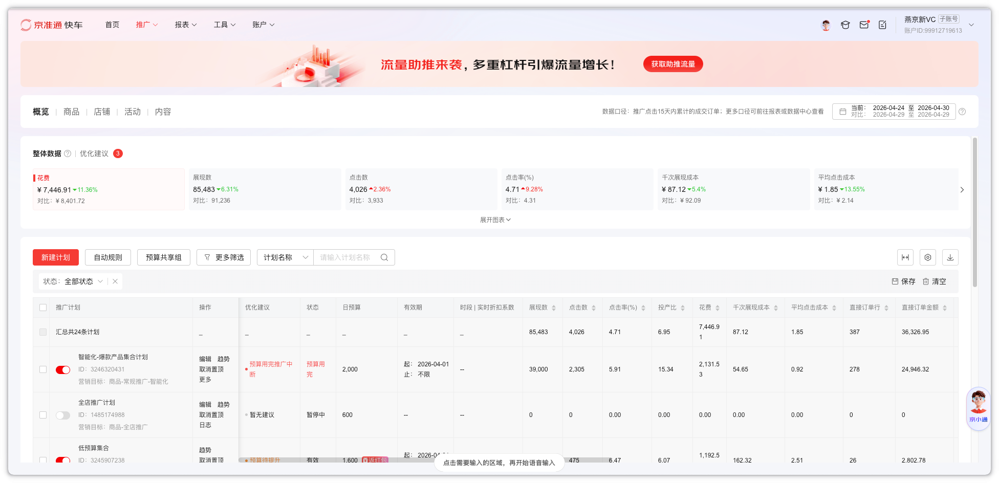
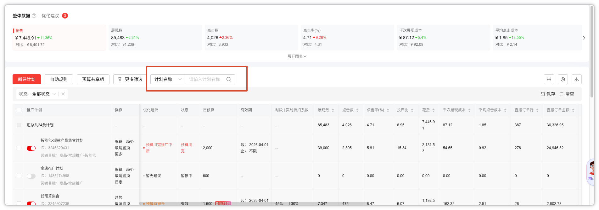
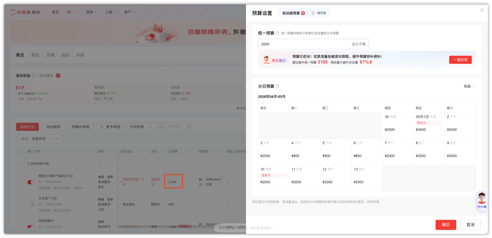
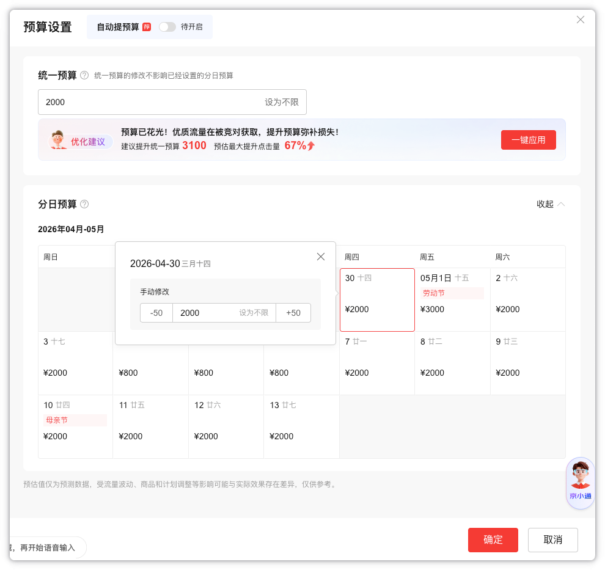

```
前提：
用户会给定一个表格，表格有第一列是计划名称，后面的列都是日期，日期下面对应的值是该日期需要设置的预算值
```
# 第一步：进入概览页面
进入页面链接：https://jzt.jd.com/msa/#/list/tab/plan?objective=overview



# 第二步：搜索计划名称
找到页面的“计划名称”搜索框，输入表格指定的计划名称，搜索


# 第三步：点击日预算
搜索出来的计划，有一列名为：“日预算”，点击“日预算”列的值，会弹出一个“预算设置”右侧抽屉弹窗


# 第四步：批量设置每日的预算
 1.预算设置”右侧抽屉弹窗中有一部分为分日预算，如果分日预算列表没有展开的话，右侧有一个“展开”按钮，即可展开，展开之后，“展开”按钮会变为“收起”按钮

 2.可以设置今日起 14 天内的每日预算

 3.根据表格中给定的日期，点击某一日的预算值，会有一个小弹窗来设置该日的预算，设成表格中该日期指定的预算值
 
 
 4.点击确认保存

 # 第五步：循环设置
循环设置表格中给的计划的指定日期的指定预算值
